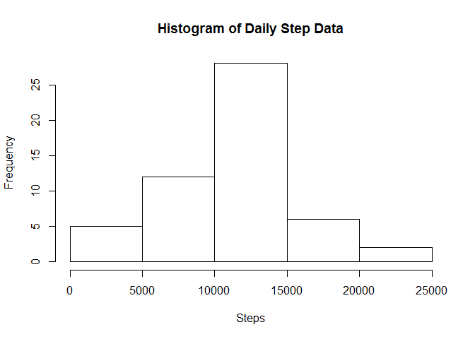
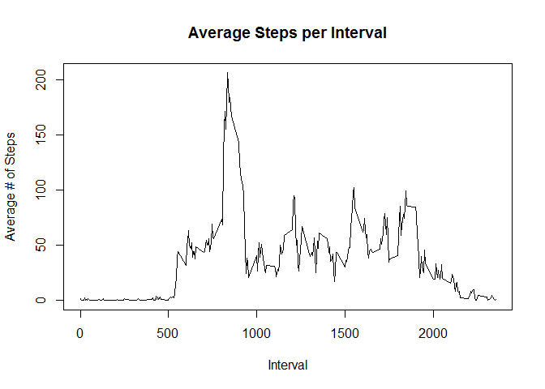
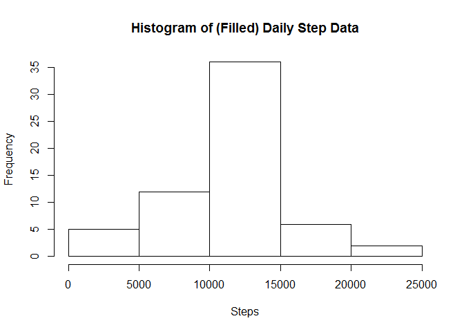

# Reproducible Research: Peer Assessment 1
Nicolas Figueroa  
Sunday, October 18, 2015  


## Loading and preprocessing the data

Show any code that is needed to

1. Load the data (i.e. read.csv())

2. Process/transform the data (if necessary) into a format suitable for your analysis

Load the data. (if needed , download)


```r
dataUrl <- "https://d396qusza40orc.cloudfront.net/repdata%2Fdata%2Factivity.zip"
zip <- paste(getwd(), "/activity.zip", sep = "")
myFile <- paste(getwd(), "/data/activity.csv", sep = "")
data <- "data"
```


```r
if(!file.exists(data)){
  dir.create(data)
}
```


```r
if(!file.exists(zip)){
  download.file(dataUrl, zip, mode="wb")
}
```


```r
if(!file.exists(myFile)){
    unzip(zip, list = FALSE, overwrite = FALSE, exdir = data)
}
```


```r
activity <- read.table(file = myFile, header = TRUE, sep = ",")
summary(activity)
```

```
##      steps                date          interval     
##  Min.   :  0.00   2012-10-01:  288   Min.   :   0.0  
##  1st Qu.:  0.00   2012-10-02:  288   1st Qu.: 588.8  
##  Median :  0.00   2012-10-03:  288   Median :1177.5  
##  Mean   : 37.38   2012-10-04:  288   Mean   :1177.5  
##  3rd Qu.: 12.00   2012-10-05:  288   3rd Qu.:1766.2  
##  Max.   :806.00   2012-10-06:  288   Max.   :2355.0  
##  NA's   :2304     (Other)   :15840
```


## What is mean total number of steps taken per day?

For this part of the assignment, you can ignore the missing values in the dataset.

1. Calculate the total number of steps taken per day

2. If you do not understand the difference between a histogram and a barplot, research the difference between them. Make a histogram of the total number of steps taken each day.

3. Calculate and report the mean and median of the total number of steps taken per day

The total number of step per day:


```r
dailySteps = aggregate(steps ~ date, activity, sum, na.rm=T)
```

The histogram:


```r
hist(dailySteps$steps, xlab = "Steps", main = "Histogram of Daily Step Data")
```

 

Mean number of steps per day:


```r
mean(dailySteps$steps, na.rm = T)
```

```
## [1] 10766.19
```

Median number of steps per day:

```r
median(dailySteps$steps, na.rm=T)
```

```
## [1] 10765
```


## What is the average daily activity pattern?

1. Make a time series plot (i.e. type = "l") of the 5-minute interval (x-axis) and the average number of steps taken, averaged across all days (y-axis)

2. Which 5-minute interval, on average across all the days in the dataset, contains the maximum number of steps?

Time series plot:


```r
intervalSteps = aggregate(steps ~ interval, activity, mean, na.rm=T)
```


```r
plot(intervalSteps$interval, intervalSteps$steps, type = "l", xlab = "Interval", ylab = "Average # of Steps", main = "Average Steps per Interval" )
```

 


The interval which contains the maximun number of steps is:


```r
intervalSteps[max(intervalSteps$steps) == intervalSteps$steps,]
```

```
##     interval    steps
## 104      835 206.1698
```


## Imputing missing values

Note that there are a number of days/intervals where there are missing values (coded as NA). The presence of missing days may introduce bias into some calculations or summaries of the data.

1. Calculate and report the total number of missing values in the dataset (i.e. the total number of rows with NAs)

2. Devise a strategy for filling in all of the missing values in the dataset. The strategy does not need to be sophisticated. For example, you could use the mean/median for that day, or the mean for that 5-minute interval, etc.

3. Create a new dataset that is equal to the original dataset but with the missing data filled in.

4. Make a histogram of the total number of steps taken each day and Calculate and report the mean and median total number of steps taken per day.


The total number of missing values in the dataset:

```r
nrow(activity) - sum(complete.cases(activity))
```

```
## [1] 2304
```


I use the mean...


```r
filledData = activity
for (i in 1:nrow(activity)) {
    if (is.na(filledData$steps[i])){
        filledData$steps[i] = intervalSteps[filledData$interval[i] == 
                                                intervalSteps$interval, 2]
    }
}
```


The histogram


```r
filledDailySteps = aggregate(steps~date,filledData, sum)

hist(filledDailySteps$steps, xlab = "Steps", 
                main = "Histogram of (Filled) Daily Step Data")
```

 

The values:


```r
mean(filledDailySteps$steps)
```

```
## [1] 10766.19
```

```r
median(filledDailySteps$steps)
```

```
## [1] 10766.19
```

Do these values differ from the estimates from the first part of the assignment? 
What is the impact of imputing missing data on the estimates of the total daily number of steps?


```r
filledMean = mean(filledDailySteps$steps)
meanSteps = mean(dailySteps$steps, na.rm = T)
meanSteps - filledMean
```

```
## [1] 0
```


```r
filledMedian = median(filledDailySteps$steps)
medianSteps = median(dailySteps$steps, na.rm=T)
medianSteps - filledMedian
```

```
## [1] -1.188679
```


The change is minimal. Only increase the central bar in plot, which is that the criteria for selecting attribute values it was the mean. This explains why the median is greater in the dataset with imputed values


## Are there differences in activity patterns between weekdays and weekends?

For this part the weekdays() function may be of some help here. Use the dataset with the filled-in missing values for this part.

1. Create a new factor variable in the dataset with two levels – “weekday” and “weekend” indicating whether a given date is a weekday or weekend day.


2. Make a panel plot containing a time series plot (i.e. type = "l") of the 5-minute interval (x-axis) and the average number of steps taken, averaged across all weekday days or weekend days (y-axis). See the README file in the GitHub repository to see an example of what this plot should look like using simulated data.


```r
filledData$day<-weekdays(as.Date(filledData$date))
filledData[filledData$day=="lunes",]$day   <-"Weekday"
filledData[filledData$day=="martes",]$day   <-"Weekday"
filledData[filledData$day=="miércoles",]$day   <-"Weekday"
filledData[filledData$day=="jueves",]$day   <-"Weekday"
filledData[filledData$day=="viernes",]$day   <-"Weekday"
filledData[filledData$day=="sábado",]$day   <-"Weekend"
filledData[filledData$day=="domingo",]$day   <-"Weekend"
filledData$dat<-as.factor(filledData$day)
summary(filledData)
```

```
##      steps                date          interval          day           
##  Min.   :  0.00   2012-10-01:  288   Min.   :   0.0   Length:17568      
##  1st Qu.:  0.00   2012-10-02:  288   1st Qu.: 588.8   Class :character  
##  Median :  0.00   2012-10-03:  288   Median :1177.5   Mode  :character  
##  Mean   : 37.38   2012-10-04:  288   Mean   :1177.5                     
##  3rd Qu.: 27.00   2012-10-05:  288   3rd Qu.:1766.2                     
##  Max.   :806.00   2012-10-06:  288   Max.   :2355.0                     
##                   (Other)   :15840                                      
##       dat       
##  Weekday:12960  
##  Weekend: 4608  
##                 
##                 
##                 
##                 
## 
```

The plot:

```r
WeekdayData<-filledData[filledData$day=="Weekday",]

WeekdayNumSteps<-tapply(WeekdayData$steps,WeekdayData$interval,mean,na.rm=TRUE,simplify=TRUE)
WeekdayIntervals<-levels(as.factor(WeekdayData$interval))

WeekendData<-filledData[filledData$day=="Weekend",]
WeekendNumSteps<-tapply(WeekendData$steps,WeekendData$interval,mean,na.rm=TRUE)
WeekendIntervals<-levels(as.factor(WeekendData$interval))

NewData1<-data.frame("steps"=WeekdayNumSteps,"interval"=WeekdayIntervals,"day"="Weekday")
NewData2<-data.frame("steps"=WeekendNumSteps,"interval"=WeekendIntervals,"day"="Weekend")
NewData<-rbind(NewData1,NewData2)

library(lattice)
xyplot(steps~as.numeric(as.character(interval))|day,type="l",data=NewData,layout=c(1,2),xlab="Interval",ylab="Number of steps")
```

 

